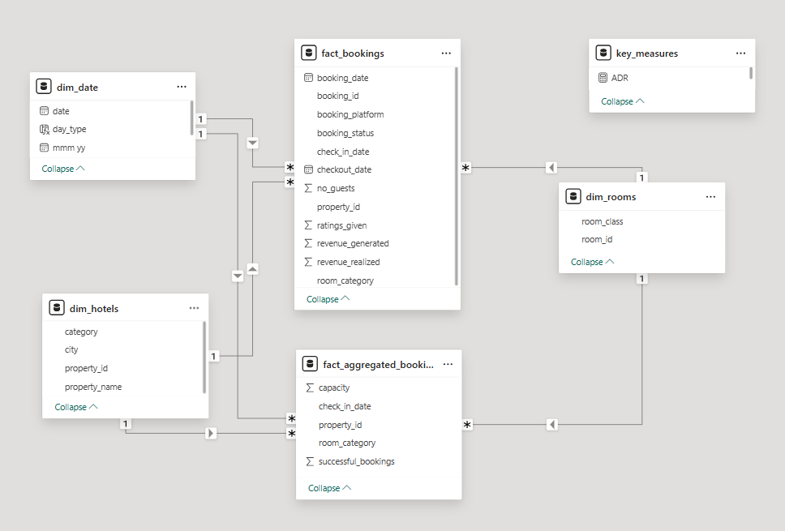
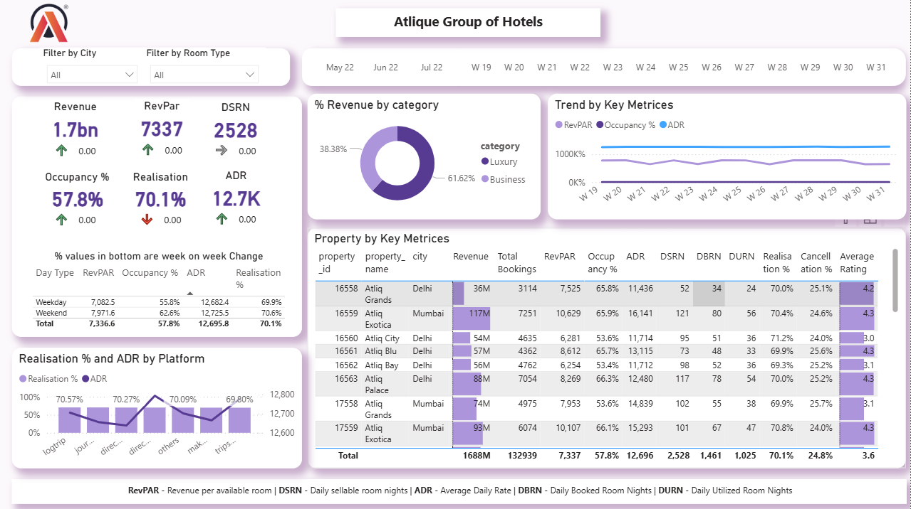

# Atlique_Grands_DataAnalysis_Project-PowerBI 
Project Category: Hospitality Domain
[Click Here to get Dataset](https://codebasics.io/resources/end-to-end-data-analyst-project)

## Project Overview
This project is a complete end-to-end Power BI data analytics solution built for AtliQ Grands, a premium five-star hotel chain operating across India. Due to rising competition and poor decision-making, the company experienced a decline in market share, occupancy, and revenue performance.

To support strategic decision-making, the revenue management team wanted to adopt Business & Data Intelligence. This project simulates a real-world scenario where a Data Analyst is hired to build a reporting system using AtliQ’s historical data.
The goal of this project is to:
- Build business-critical KPIs used in the hospitality industry
- Create a dashboard aligned with stakeholder requirements
- Enable actionable insights for improving revenue, occupancy, and performance
- Present a clean data model using a star schema
- Deliver analysis beyond the provided mock-up

## Project Objectives
As a Data Analyst, my task was to:
- Build all key business metrics from the metric list
- Design an interactive Power BI dashboard following the stakeholder mock-up
- Identify additional insights beyond the provided mock-up
- Ensure the dashboard supports strategic decisions around revenue, occupancy, and performance

## Tech Stack Used
Power BI Desktop
- DAX (Advanced Measures & Time Intelligence)
- Power Query (Data Cleaning & Transformations)
- Star Schema Dimensional Modeling
- Business Performance Metrics (RevPAR, ADR, DSRN, etc.)

## Data Modeling & Architecture
I created a Star Schema for optimal performance:
Fact Tables:
- `fact_bookings` – booking details, revenue, guests
- `fact_aggregated_bookings` – room capacity & successful bookings

Dimension Tables:
- `dim_hotels` – hotel details
- `dim_rooms` – room categories & classes
- `dim_date` – date hierarchy
- `key_measures` – centralized DAX measures
This model allowed smooth filtering across cities, room types, platforms, and dates.

## Metrics Built (DAX)
Some of the major KPIs developed:
- Revenue (bn)
- RevPAR (Revenue per Available Room)
- ADR (Average Daily Rate)
- Occupancy %
- Realisation %
- DSRN/DBRN/DURN
- Cancellation %
- Average Rating
These were enhanced with WoW (Week over Week) performance trends.

---

## Dashboard Highlights

### 1. Overall KPI Summary
- A high-level snapshot of:
- Revenue: ₹1.7bn
- RevPAR: 7337
- Occupancy: 57.8%
- Realisation: 70.1%
- ADR: 12.7K
- Total Bookings: 132,939
With week-over-week comparison arrows to quickly spot performance shifts.

### 2. Revenue Breakdown by Category
A donut visual showing:
- Luxury Hotels – 61.62% of revenue
- Business Hotels – 38.38%
This helps understand which segment drives more financial value.

### 3. Trend Analysis by Key Metrics
Week-wise view of:
- RevPAR
- ADR
- Occupancy
This helped identify weekly seasonality and performance dips.

### 4. Property-wise Performance
A detailed matrix showcasing:
- Revenue contribution
- Total bookings
- RevPAR
- Occupancy %
- ADR
- Realisation %
- Average rating (1–5 scale)
This allowed quick identification of high-performing vs. underperforming hotels.

### 5. Realisation % & ADR by Booking Platform
Analyzed how platforms like:
- Direct
- Online (OTA)
- Travel agents
- Company bookings
impact profitability and pricing.

---

## Key Insights Derived

Here are the top insights generated from the dashboard:
- Luxury Hotels generate 62% of total revenue, making them the primary revenue driver.
- Average Realisation % is strong at 70.1%, but varies significantly by property.
- Occupancy is moderate at 57.8%, meaning there is room to optimize pricing and promotions.
- Platform analysis revealed that Direct bookings have the highest ADR, indicating higher profitability compared to OTAs.
- Some properties in Delhi show lower occupancy (53–55%), pulling down overall RevPAR.
- Cancellation rate stands at 24.8%, suggesting potential issues in booking policy or customer behavior.
- Properties with lower customer ratings (3.0 – 3.5) also show weaker performance — indicating service quality impacts revenue.

## Conclusion
This project simulates a real-world hospitality BI solution, focusing on business understanding, data modeling, dashboard design, and insight generation. It demonstrates practical skills in Power BI, DAX, data storytelling, and domain-specific analytics.

---

## Contributing
If you would like to contribute to this project, feel free to fork the repository, submit pull requests, or raise issues.

---

## License
This project is licensed under the MIT License.

